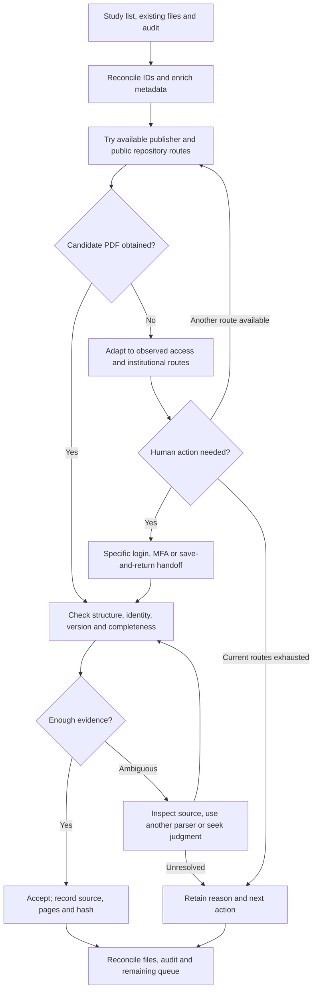

# Literature PDF Retrieval

**Turn a study list into a traceable, checked collection of full texts.**

[中文](README.zh-CN.md) · [Strategy and human handoff](literature-pdf-retrieval/references/access-and-handoff.md) · [Example prompts](literature-pdf-retrieval/references/examples.md) · [Validation](docs/VALIDATION.md)

New to the workflow? **[Watch the five-minute introduction](https://github.com/Beeeeeeelle/review-evidence-workflow/blob/main/docs/intro/README.md)**, in English or Chinese, to see retrieval, human access handoffs and the connection to review.

Finding a PDF can mean following a repository link, discovering an institutional access route, or asking someone to save a file that their browser can open. Obtaining the file is only the beginning: it must correspond to the intended article, chapter and version.

This standalone agent skill organizes that work. The agent tries available routes, records the result, adapts to observed access conditions, and gives you a specific handoff when login, MFA or manual saving is needed. Returned files go through the same checks. A later session resumes from the audit.

## When to use it

| Starting point | What the skill helps produce |
|---|---|
| Excel, CSV or RIS study list with missing full texts | Normalized IDs, retrieval batches and an actionable remaining queue |
| Publisher asks for payment; your institution may subscribe | Official library/resolver routes and observed access evidence |
| A previous run stopped at login or manual download | Precise human steps, followed by resumed validation |
| Existing PDFs may be mismatched | Identity triage, provenance and isolated suspect files |
| A whole issue or wrong version was downloaded | Preserved originals, target-page extraction or replacement with a change record |

The skill prepares sources. Researchers own the review question, eligibility criteria, codebook and scientific judgments. The optional [Review Evidence Workflow](https://github.com/Beeeeeeelle/review-evidence-workflow) handles downstream screening, coding and reviewer returns. Either skill can be used independently.

## How a run works



A library link is a route to try, not proof of entitlement. A person may unlock a session or save a few files while the agent continues accessible records. Human-supplied PDFs are checked too.

## Get started

Install in an agent that supports local `SKILL.md` packages. For Codex:

```bash
git clone https://github.com/Beeeeeeelle/literature-pdf-retrieval.git
mkdir -p ~/.codex/skills
cp -R literature-pdf-retrieval/literature-pdf-retrieval ~/.codex/skills/
```

Back up an existing installation before replacing it. The helpers need Python 3.10+:

```bash
cd literature-pdf-retrieval
python3 -m venv .venv
source .venv/bin/activate
python -m pip install -r requirements.txt
```

Provide your study list, existing PDFs and previous audit, then ask:

> Use $literature-pdf-retrieval to find missing full texts for this list. Preserve source files and IDs. Try available routes first. When you need me to log in or save a PDF, give me the record, landing page, exact action and return location. Report acquisition, identity checks and unresolved reasons separately.

Follow up with:

> I can use my university library. Check which resources may cover the remaining records and tell me when sign-in is needed.

> I have returned the manually saved PDFs. Resume validation and keep the earlier attempt history.

Start with the files you have; supply access details when relevant. Institutional access is optional and affects coverage.

## Outputs and helper commands

- Accepted ID-named PDFs, plus isolated pending/rejected candidates.
- `record_state.csv`: current state and identity evidence for each record.
- `retrieval_attempts.csv`: append-only route attempts and outcomes.
- A validation report and remaining queue with specific reasons and next actions.

The agent uses its available search/browser tools. Bundled Python scripts perform **local validation and page extraction**, not network search or authentication. Normalizing spreadsheets/RIS uses the agent's available tools; the validator itself reads CSV.

```bash
python literature-pdf-retrieval/scripts/validate_pdf_audit.py \
  --audit /path/record_state.csv --pdf-dir /path/pdfs \
  --require-identity --json-out /path/validation.json

python literature-pdf-retrieval/scripts/extract_article_pages.py \
  /path/issue.pdf /path/staging/R017.pdf --start 12 --end 23
```

See [CSV examples and schema notes](examples/README.md). Page ranges are inclusive PDF page numbers. Originals and existing outputs are not overwritten. A helper identity pass is early-text triage; it does not certify completeness or publication version.

## Design decisions and evidence

**Adapt routes to observations.** Enrich missing metadata, explore public and authorized institutional sources, stop blocked routes, and make human access steps concrete.

**Separate acquisition from identity acceptance.** A fresh check of 130 Agency files yielded 127 automatic identity passes and 3 flags. A second parser found the expected DOI for 2 flags; an anonymous draft with a placeholder DOI still required version review. File presence alone would have hidden this distinction.

**Retain state and history separately.** Resume without repeating exhausted paths; preserve replaced files and hashes so downstream extraction can be marked stale.

Read [validation scope and case evidence](docs/VALIDATION.md). These are bounded examples, not a benchmark, a measured time saving, or a promise to obtain every full text.

MIT applies to repository code and documentation, not to third-party papers.
