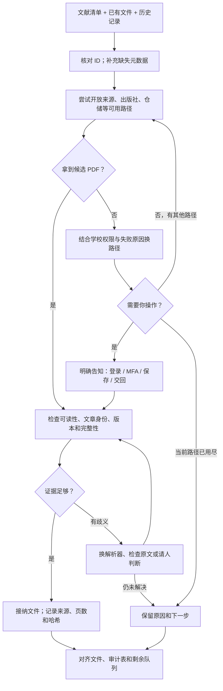

# Literature PDF Retrieval

**把文献清单变成可核对、可接着用的全文资料。**

[English](README.md) · [详细策略](docs/STRATEGY.zh-CN.md) · [提问示例](literature-pdf-retrieval/references/examples.md) · [验证记录](docs/VALIDATION.md)

第一次接触这套方法？看 **[五分钟入门视频（中英双版）](https://github.com/Beeeeeeelle/review-evidence-workflow/blob/main/docs/intro/README.zh-CN.md)**，认识找全文、人工访问接力，以及怎样接到后面的审阅。

**Belle 新版视觉导览：[看中英双版视频](https://github.com/Beeeeeeelle/review-evidence-workflow/blob/main/docs/watch/README.zh-CN.md)**。上方原版视频继续保留。

直接在这里播放入门导览：

https://github.com/user-attachments/assets/efba3032-361e-4b46-84ae-61aaa72d460f

找 PDF 往往不只是搜标题、点下载：有的文章换了地址，有的藏在学校图书馆的资源里，有的能打开却需要你手动保存。文件拿到以后，还得确认它是不是那篇文章、是不是需要的章节和版本。

这个独立的 agent skill 负责这一段工作。AI 先尝试可用的路径，记录结果，再根据实际情况换策略。遇到登录、MFA 或需要手动下载的地方，它会告诉你具体做哪一步；你把文件交回来，它接着核对。每次进展都留下记录，下次可以从中断处继续。

## 什么时候用

| 你现在的情况 | 它会帮你做什么 |
|---|---|
| 有 Excel、CSV 或 RIS 文献清单，还缺全文 | 整理 ID 和元数据，分批查找，留下已找到和待处理清单 |
| 学校可能订阅了，但直接访问要付费 | 查找官方图书馆入口和馆藏线索，尝试你有权使用的访问路径 |
| 上一轮卡在登录或手动下载 | 给出具体操作和文件交回位置，回来后继续核对 |
| 文件夹里已有 PDF，但不确定是否对应 | 比对 DOI、标题及必要的作者/版本信息，隔离疑似错文 |
| 找到的是整期刊物或错误版本 | 保留原文件，提取目标页或寻找替代文件，并记录变化 |

它负责**全文准备**。研究问题、纳排标准、codebook 和科学判断仍由研究者掌握；后续筛选、编码和团队审阅可以交给 [Review Evidence Workflow](https://github.com/Beeeeeeelle/review-evidence-workflow)。两者可以搭配，也可以单独用。

## 一轮工作怎样进行



**人参与的是明确的操作与判断。** AI 可以发现图书馆提供了另一条路径，但不能从一个图书馆链接就推断你一定有权限。你可能只需要完成一次登录，或保存几份工具无法直接下载的文件。人工交回的文件同样要核对，不会直接视为正确。

## 怎么开始

在支持本地 `SKILL.md` 的 agent 中安装。以 Codex 为例：

```bash
git clone https://github.com/Beeeeeeelle/literature-pdf-retrieval.git
mkdir -p ~/.codex/skills
cp -R literature-pdf-retrieval/literature-pdf-retrieval ~/.codex/skills/
```

如果已经安装过，先备份旧目录，再替换。辅助脚本需要 Python 3.10+；建议在仓库内建立虚拟环境：

```bash
cd literature-pdf-retrieval
python3 -m venv .venv
source .venv/bin/activate
python -m pip install -r requirements.txt
```

将文献表、已有 PDF 和旧记录提供给 agent，然后这样问：

> 用 $literature-pdf-retrieval 帮我找这份清单里缺的全文。已有文件在这个文件夹，保留原件和文献 ID。先尝试你能操作的路径；需要我登录或下载时，告诉我具体文章、入口、操作和交回位置。最后分别报告文件获取情况、身份核对情况和仍待处理的原因。

接着可以说：

> 我可以使用学校图书馆。请先看哪些资源能覆盖剩下的文章，需要我登录时再告诉我。

> 我已经把手动下载的文件放回来了。请继续核对，保留上一轮的尝试记录。

不必一开始回答一长串设置问题。先提供清单和文件，缺少访问条件时再补。没有机构权限也能运行，只是可获取的来源可能不同。

## 你会拿到什么

- 按文献 ID 命名、通过核对的 PDF，以及待核对/被拒绝的候选文件。
- `record_state.csv`：每篇文献目前的状态与身份依据。
- `retrieval_attempts.csv`：试过哪些路径、为什么失败、后来怎样解决。
- 验证报告，以及每项都有原因和下一步的剩余队列。

下载、登录与检索依赖 agent 当时可用的浏览器/搜索工具。仓库自带的 Python 脚本用于**本地核对和页面提取**，不是一个独立的全网下载器。

## 为什么这样设计

**换策略，而不是反复点同一个失败链接。** 缺 DOI 时先补元数据；公开路径走不通时查机构资源；遇到需要人操作的节点，把任务交代清楚后继续处理其他文献。

**区分“拿到文件”和“拿对文件”。** 在 Agency 的一次 130 份文件复核中，默认解析器留下了 3 条身份疑点。换解析器后，其中 2 条找到了预期 DOI；另 1 份是带占位 DOI 的匿名稿，仍需要核对版本。这正说明：文件齐了，不等于身份和版本全部确认。

**保留过程，方便接力。** 当前状态和尝试历史分开保存；替换错文后记录新哈希，让后续提取知道旧来源已经改变。

更多例子、策略与边界见 [详细说明](docs/STRATEGY.zh-CN.md)；测试范围见 [验证记录](docs/VALIDATION.md)。单个项目的获取情况不代表其他项目也能找到全部全文。

MIT 许可适用于本仓库代码与文档；所获取论文的权利仍归各自权利人。
